# Module 1

## Introduction

This is a Ruby on Rails tutorial that I prepared and used to help students when I was a TA (Teaching Assistant) in the Ruby on Rails specialisation in Coursera. It envisions a multi layered three tier architecture and Rails powerful Model View Controller (MVC) approach. The Model is where the database resides and the Controller has capabilities to fetch data from the Model and send it to View on a browser using CRUD. These three series of tutorials are three years old and technology stacks might have changed although the concepts remain the same. It will be of help to a developer whose Ruby on Rails knowledge is rusty. I did this at the capstone level (last course in the specialisation) so a familiarity of HTML, CSS, JS, Ruby, Rails, Angular, Databases and Git are recommended.

The Capstone was composed of 7 modules and I made tutorials for the first three as they were more or less tailored for revision purposes. From the fourth module each student was required to work solo for the integrity of the course and seek help via group discussions where I would occasionally intervene or provide some guidance together with the instructors. Towards the end of last year (2020), I received an email from Johns Hopkins University that the capstone course would be retired by end of the year. In light of that, I can share this publicly as it may help someone out there.

## Tech stack

This will be a database (DB) driven application and the interface to the DB is **ActiveRecord** which puts an *Object/Relational Mapper* as I input objects and methods whilst coding. Sometimes I'll drop complex queries in SQL or even build snippets of WHERE clauses and SELECT clauses or even do full-scale raw SQL commands which are more efficient. Where I deem fit I'll make snapshots of Bash available but sparingly as this documentation may become too long.

I'll use MongoDB (NoSQL) which uses Mongoid as the object document mapper. It provides a nice ActiveRecord like interface to the back-end document store. I won't use GridFS but BSON::Binary type which I'll use to store in documents.

Those documents will be related to RDBM which has the object that has data, eg photo on a file. In Mongo, I'll store the actual content i.e photo as you saw in [Course 3](https://github.com/appwebtech/Ruby_on_Rails_Certification/tree/master/3_Ruby_on_Rails_Web_Services_and_Integration_with_MongoDB/MODULE%2002).
This will later on be useful for Google geo code API in finding positioning.

On the Browser side, I won't use file storage, but on the contrary, a module; the **ng-token-auth** module which will store current login info into the Browser Cookie store to avoid successive re-authentication.

As I progress within the tutorials, I'll try my best to document both the materials (gems, applications, etc) best practices and the easiest way to solve problems.

The application frameworks and languages used are as follows;

### Server Side
1. Rails API gem
2. Rails
3. WEBrick / Puma / ActiveModel
4. Ruby

### Client Side
1. AngularJS
2. Javascript
3. HTML
4. CSS

## Technical Architecture Diagram
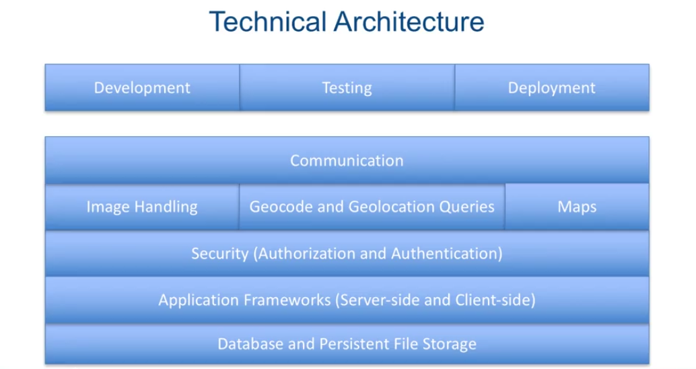
<hr>

## DB and File Storage
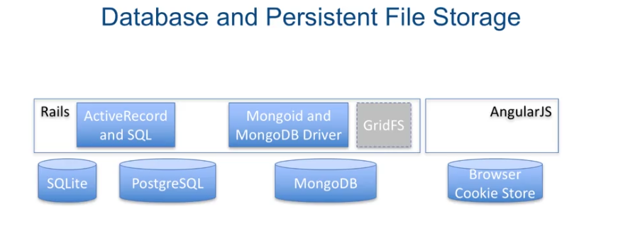
<hr>

## Application Frameworks and Languages
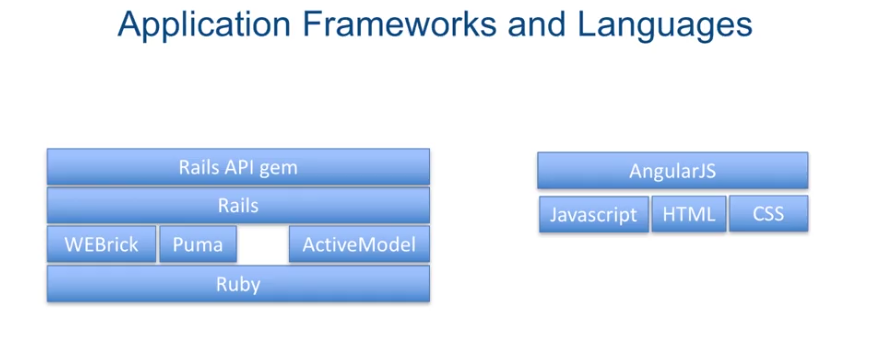
<hr>

## Coding Environment

```
- macOS Sierra Version 10.12.2(16C67) (Running on an iMac)

- OS X El Capitan Version 10.11.6 (Running on a MacBook Pro)
  (Using different specs eg Rails 5, Puma, etc for comparison purposes)

- Firefox (v45.7.0 ESR) ~ Extended Support Release

- Ruby 2.3.1p112 (2016-04-26 revision 54768) [x86_64-darwin16]

- Rails 5.0.2

- Rails 4.2.6  (Will scaled back from rails 5.0.2 to curb esoteric issues)

- Rails-api '~>0.4', '>=0.4.0'

- Homebrew 1.1.9

- rbenv 1.1.0

- Git v2.11.1

- PostgreSQL 9.6.1

- Mongo DB version v3.4.2

- NodeJS v6.6.0

- ImageMagick 7.0.4-7 Q16 x86_64 2017-02-04

- PhantomJS v2.1.1

- Chrome Driver for selenium
  2.27.440174 (e97a722caafc2d3a8b807ee115bfb307f7d2cfd9)

- Editor: Sublime text 3

```

## App Setup

My RDBMS choice is PG due to it's robustness and production capability (Requires DB server Installation). It's consistent with development and deployment, as opposed to SQLite (No DB Requirement) which is a functional lightweight administration.

Using Full Rails server sucks due to it's "full kitchen sink" of JSON's, Views, Asset Pipeline, ERB, etc. What I've done is use an API with client-side web pages (JS, Angular etc); the server (Webrick) will provide API to client-side web pages. I'm versatile with it as I can turn on features that I want instead of overloading my work-flow.

## DB yml environment set-up

```ruby
default: &default
  adapter: postgresql
  encoding: unicode
  pool: 5
  username: <%= ENV['POSTGRES_USER'] %>
  password: <%= ENV['POSTGRES_PASSWORD'] %>
  host: <%= ENV['POSTGRES_HOST'] %>

development:
  <<: *default
  database: MODULE_01_development

test:
  <<: *default
  database: MODULE_01_test


production:
  adapter: postgresql
  encoding: unicode
  pool: 5
  url: <%= ENV['DATABASE_URL'] %>

```

 In a nutshell:
 - I chose RDBMS (PostgreSQL)
 - I chose Rails API as my server.
 - I Instantiated the App
 - I readied the RDBMS schema
 - I re-enabled the View

## What the App should do

The App is RDBMS and MongoDB backed, and thus should create RDBMS & MongoDB backed models and expose RDBMS & MongoDB backed API resources.

What I'll do is install rspec and change the **api_development_spec.rb** from it's default installations to accommodate our DB's.

```ruby
# Do away with this
RSpec.describe "ApiDevelopments", type: :request do
  describe "GET /api_developments" do
    it "works! (now write some real specs)" do
      get api_developments_path
      expect(response).to have_http_status(200)
    end
  end
end

# Add this
RSpec.describe "ApiDevelopments", type: :request do
  describe "RDBMS-backed" do
    it "create RDBMS-backed model"
    it "expose RDBMS-backed API resource"  
  end

   describe "MongoDB-backed" do
    it "create MongoDB-backed model"
    it "expose MongoDB-backed API resource"  
  end
end
```

Haven't done much here. Just written some simple tests to see if RDBMS and NoSQL are configured and working well.

## RDBMS Backed Resource

Created tests for the RDBMS-backed model and exposed to API resource, then ran tests with rspec. Corrected errors until tests went green.

```ruby
RSpec.describe "ApiDevelopments", type: :request do
    def parsed_body
        JSON.parse(response.body)
    end

  describe "RDBMS-backed" do
    before(:each) { Josembi.delete_all }
    after(:each) { Josembi.delete_all }

    it "create RDBMS-backed model" do
        object=Josembi.create(:name=>"test")
        expect(Josembi.find(object.id).name).to eq("test")
    end

    it "expose RDBMS-backed API resource"  do
        object=Josembi.create(:name=>"test")
        expect(josembis_path).to eq("/api/josembis")
        get josembi_path(object.id)
        expect(response).to have_http_status(:ok)
        expect(parsed_body["name"]).to eq("test")
    end
  end

```


For a jump-start on this application, I generated a scaffold, with the model name of Josembi and a property of "name". Due to RDBMS, the --orm points to active_record. This generated a model class and a schema migration, subsequent to which I populated the DB with a new table called Josembis that represent the model.

The Controller generated has the ability to CRUD RESTfull objects with the routing created. Then I did customizations as the /api/josembis URI wasn't working. Marvelously, HTTP methods of GETs, POSTs, PUT/PATCHes and DELETEs are working with a full control of which methods are in use and which ones are not.

I then added some data to the record via the rails console, then called it to **View** on the browser.
**VIEW** => Sends HTTP Request via */api/josembis* to Controller in my local server.
Controller class **JosembisController** via it's actions *(:index, :show, create, :update)* sends request to **Model** (*class Josembi*), which will fetch data in the table I created in the rails console.

I have an external software from google which builds json data for me. So in between the **URI/METHOD Routes** and **Controller**, an *index.json.jbuilder* & *show.json.jbuilder* was triggered to generate *_josembi.json.jbuilder*, which is what was outputted in **View**.

```ruby
class JosembisController < ApplicationController
  before_action :set_josembi, only: [:show, :update, :destroy]

  # GET /josembis
  # GET /josembis.json
  def index
    @josembis = Josembi.all

  #  render json: @josembis
  end

  def show
   # render json: @josembi
  end

  def create
    @josembi = Josembi.new(josembi_params)

    if @josembi.save
     # render json: @josembi, status: :created, location: @josembi
      render :show, status: :created, location: @josembi
    else
      render show: @josembi.errors, status: :unprocessable_entity
    end
  end

  def update
    @josembi = Josembi.find(params[:id])

    if @josembi.update(josembi_params)
      head :no_content
    else
      render json: @josembi.errors, status: :unprocessable_entity
    end
  end

  def destroy
    @josembi.destroy

    head :no_content
  end

  private
    def set_josembi
      @josembi = Josembi.find(params[:id])
    end
    def josembi_params
      params.require(:josembi).permit(:name)
    end
end
```

In summary:
 - I build skeletal resource
 - I updated rails-api controller to delegate to the view
 - I updated the route to scope below /api

## MongoDB Backed Resource

Created tests for MongoDB-backed model exposing them to the API resource.

```ruby
describe "MongoDB-backed" do
    it "create MongoDB-backed model" do
      object=FactoryGirl.create(:kasyula, :name=>"test")
      expect(Bar.find(object.id).name).to eq("test")
    end

    it "expose MongoDB-backed API resource" do
      object=FactoryGirl.create(:kasyula, :name=>"test")
      expect(bars_path).to eq("/api/bars")
      get bar_path(object.id)
      expect(response).to have_http_status(:ok)
      expect(parsed_body["name"]).to eq(object.name)
      expect(parsed_body).to include("created_at")
      expect(parsed_body).to include("id"=>object.id.to_s)
    end
  end
end
```

Failed test as in the case of RDBMS after running rspec. Generated a controller with --orm mongoid and got a partial parse. Mongoid specific prompts fail and other non Mongoid prompts parse. Rolled back the controller and installed **mongoid**, subsequent to which I generated a mongoid.yml file.

I hard coded *mongoid.yml* by supplying a mongo host environment variable so that I can access it locally from my server. For production, I set everything to a single variable, a URI and made an environment variable (MLAB_URI), a value that comes from MLAB pointing to the mongo instance.


```erb
development:
  clients:
    default:
      database: module01_development
      hosts:
        - <%= ENV['MONGO_HOST'] ||= "localhost:27017" %>
      options:
  options:
test:
  clients:
    default:
      database: module01_test
      hosts:
        - <%= ENV['MONGO_HOST'] ||= "localhost:27017" %>
      options:
        read:
          mode: :primary
        max_pool_size: 1
production:
    clients:
        default:
            uri: <%= ENV['MLAB_URI'] %>
            options:
                conect_timeout: 15
```


I then loaded the *mongoid.yml* in the application file, making it the default ORM, which can be deactivated by the lines of code I added after the Mongoid one liner.

code:  Mongoid.load!('./config/mongoid.yml')

Had issues running tests and excluded "Factory Girl rails". Rewrote mongo tests to look like below and parsed.

```ruby
       describe "MongoDB-backed" do
    before(:each) { Kasyula.delete_all }
    before(:each) { Kasyula.delete_all }

    it "create MongoDB-backed model" do
      object=Kasyula.create(:name=>"test")
      expect(Kasyula.find(object.id).name).to eq("test")
    end

    it "expose MongoDB-backed API resource" do
      object=Kasyula.create(:name=>"test")
      expect(kasyulas_path).to eq("/api/kasyulas")
      get kasyula_path(object.id)
      expect(response).to have_http_status(:ok)
      expect(parsed_body["name"]).to eq("test")
      expect(parsed_body).to include("created_at")
    end
  end
```


Later on I had to tweak "kasyula controller" to get mongoid well connected and running. Thats when my tests via rspec ran successfully and parsed.

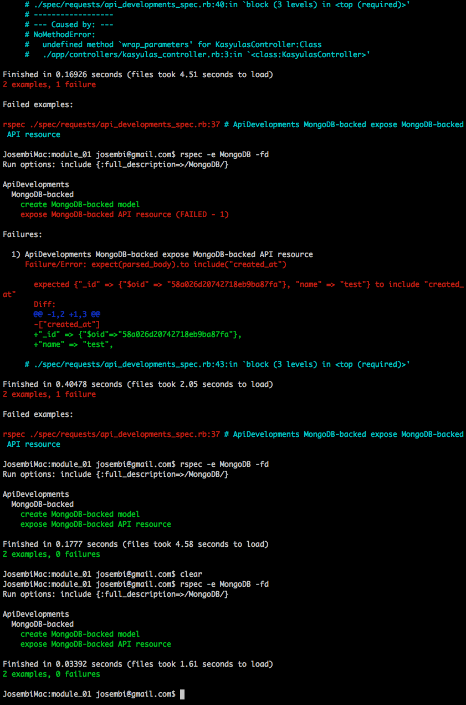
<hr>

And there we are with a false positive.

In brief:
 - I integrated MongoDB into application using Mongoid
 - I generated the skeletal resource tailored towards Mongoid
 - I updated the marshaling behavior of JSON view

## Regression Testing

Previously, I made an end-to-end RDBMS and an end-to-end Mongo DB resource. Next what I will do is an overall application test just to be sure that one didn't break the other. I'll implement an automated test to verify this features then finish with automated regression test of the entire app.

I've tested the whole app with rspec and everything DOES NOT look OK, so next, I'll need to investigate and search for solutions by accessing the  RDBMS and Mongo sides.

## Web Service Finishing Touches

I've added **HTTParty** in the development gems group, so it's time to party hard :-). Anyways, I've implemented a web service client to do various ad-hoc scripting through the HTTP interface to add, remove and query resources. I've added and queried some data via IRB in bash (see an example below).

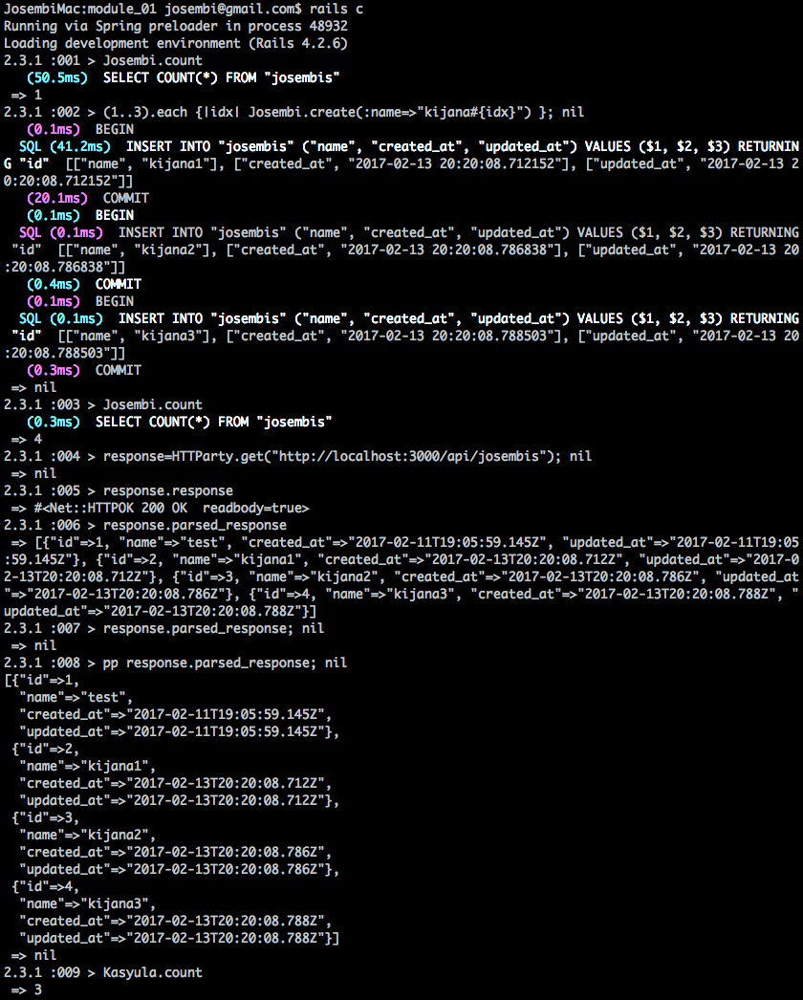
<hr>

Instead of doing SQL querying, I can still view the data via the browser in JSON.

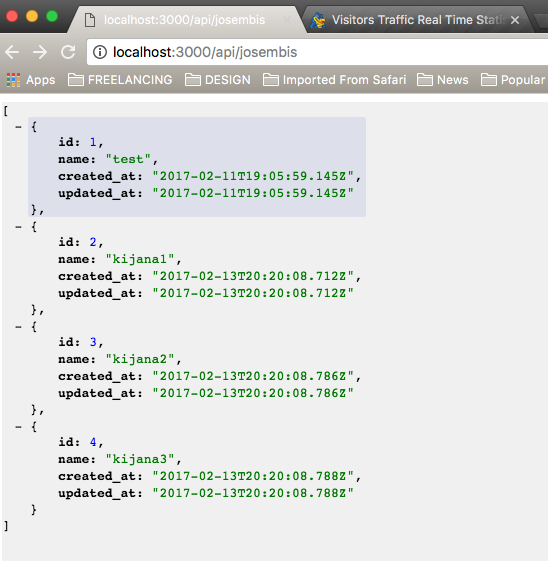
<hr>

### RDBMS side
Used arguments to Query Foo, add some data check response.

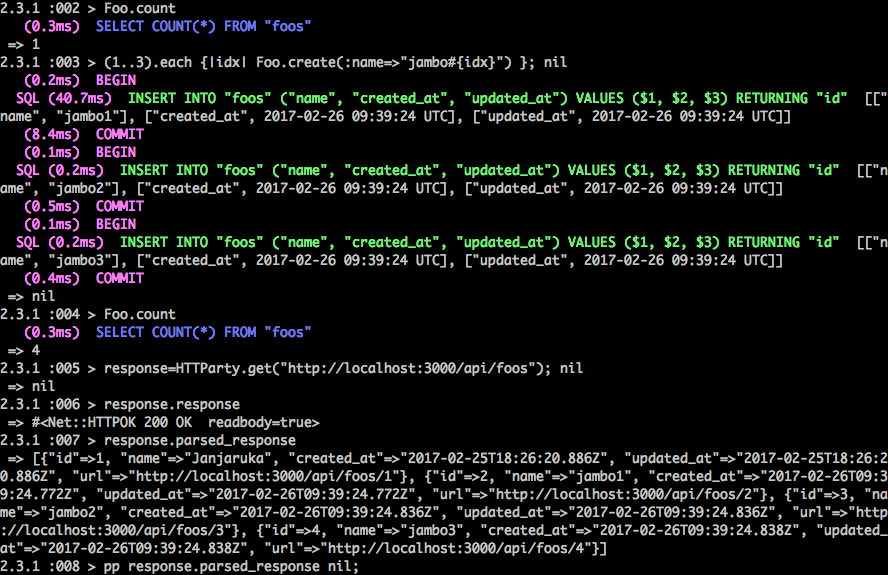
<hr>

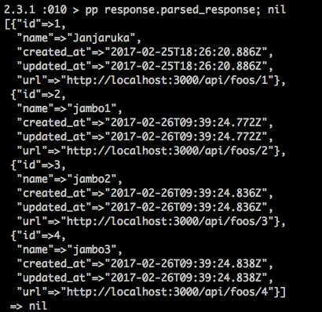
<hr>

## Mongo side
Check stored data, and use **HTTParty** to implement a web service client to do various ad-hoc scriptings through the HTTP interface to add, remove, and query resources. That way we get to sniff headers on the way in and on the way out.

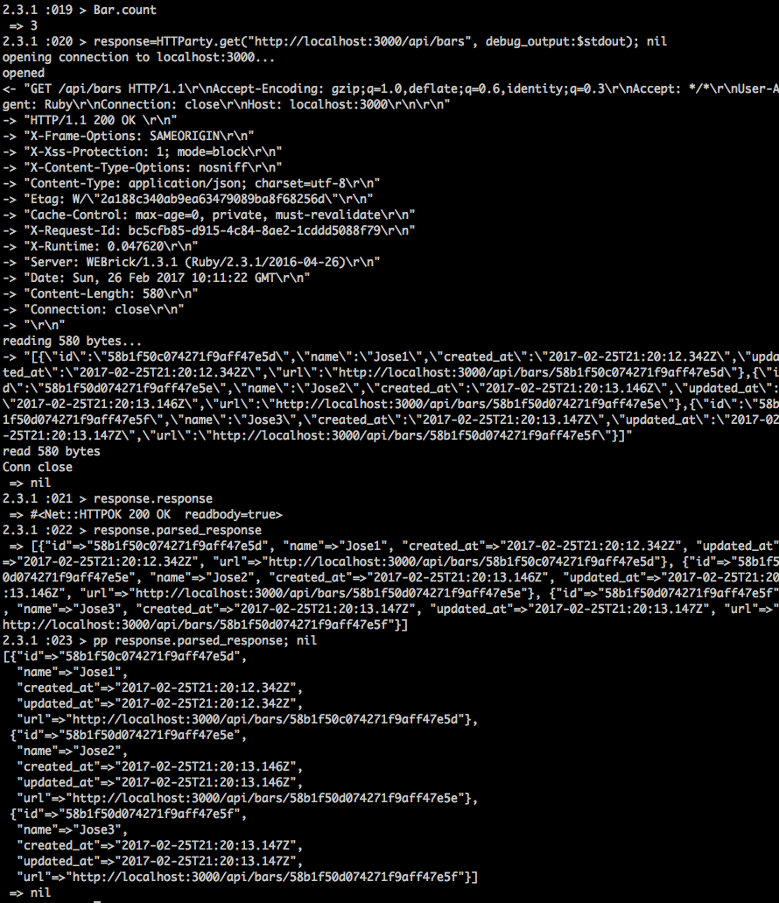
<hr>

As above, I can listen to the server, POST request, DELETE request etc, as part of CRUD in development mode using rails c; it's very powerful, but a load of mumbo jumbo that I won't post here. However, I can show how to narrow down and use an ID of a parsed body and eventually delete it if need be. *See below for a small caption.*

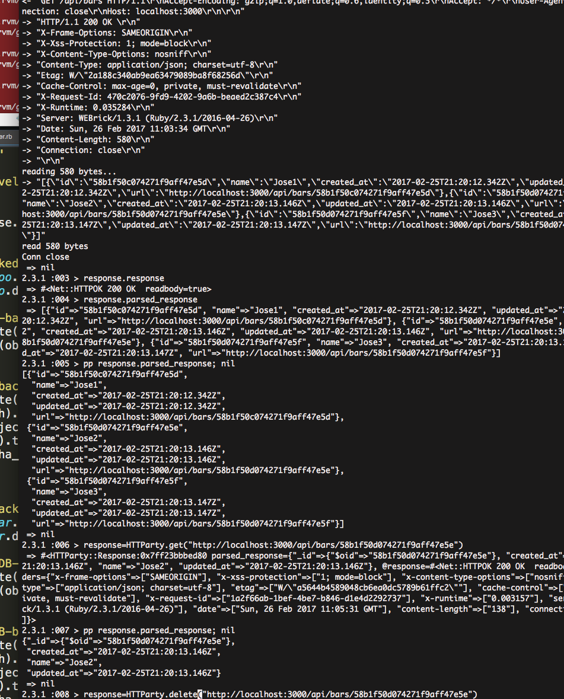
<hr>

## CORS

I'll now implement the app to comply with the browser requirement of **same origin policy** with some **Cross-Origin Resource Sharing** implementation with the server. I will be doing a dual deployment with the server going to Heroku and the UI to GitHub.

I've also added the **rack-cors** gem to enable me look at some security issues presented to browsers where APIs and UI code are deployed independently.


```
code: 'rack-cors', '~>0.4', '>=0.4.0', :require => 'rack/cors'

```

Anyways, I'll get the API server ready for this cross-origin resource sharing scenario. I want the browser to add an origin header to the calls of the server (identifying the source of the code) from say...host [Site B](http://www.siteb.com/) using code downloaded from host [Site A](http://www.sitea.com/).

I'll use the url from my local server and issue an HTTP get supplying the header (origin). Server will just supply data to browser passively and the code executed will be from [Site B](http://www.siteb.com/).

As you can see below, we have the headers thrown at us and we can do pretty anything with that site.

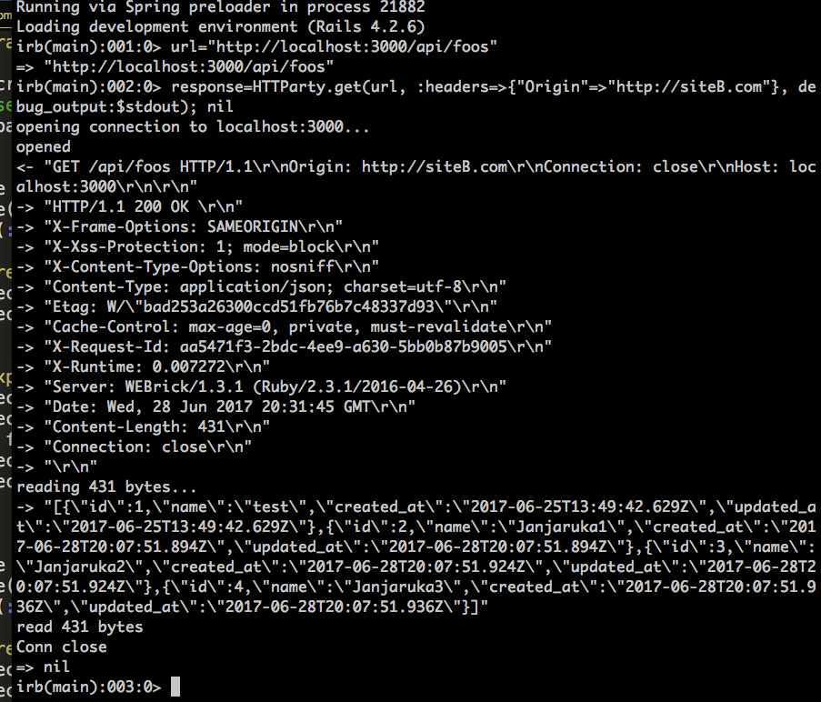
<hr>

Within the application.rb, we can use the rack gem and target [Site B](http://www.siteb.com/) to pass any header from it's downloaded code using the defined HTTP methods. See the code below.

```ruby
------
    config.middleware.insert_before 0, "Rack::Cors" do
      allow do
        origins 'siteB.com',

        resource '/api/*',
          :headers => :any,
          :methods => [:get, :post, :put, :delete, :options]
        end
      end
------

```


From the code below, I actually get the code setters supplying the definition that I put in the file for [Site B](http://www.siteb.com/). If I were to download code from [Site C](http://www.sitec.com/), I would have no definition; and the browser would prevent any code that was downloaded from Site C from invoking methods on my localhost:3000.

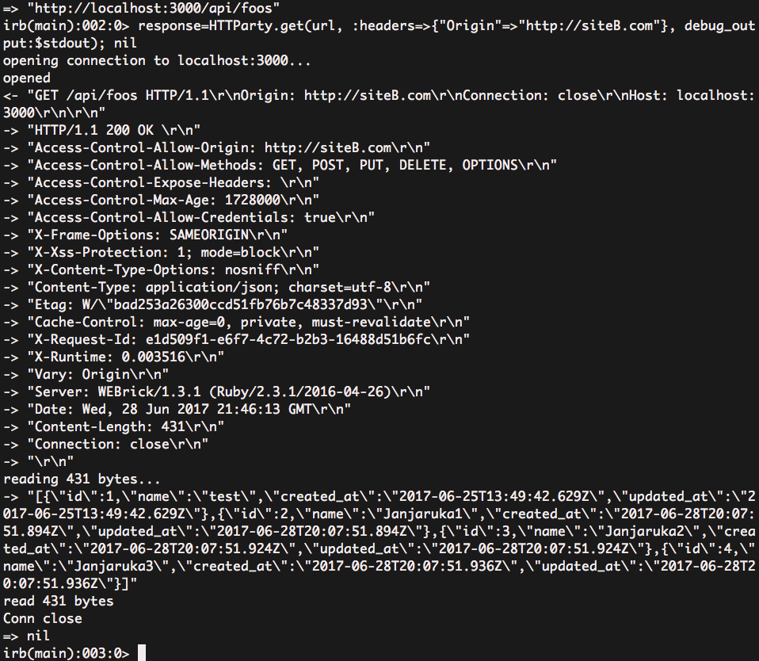
<hr>

Below, no definition from [Site C](http://www.sitec.com/).

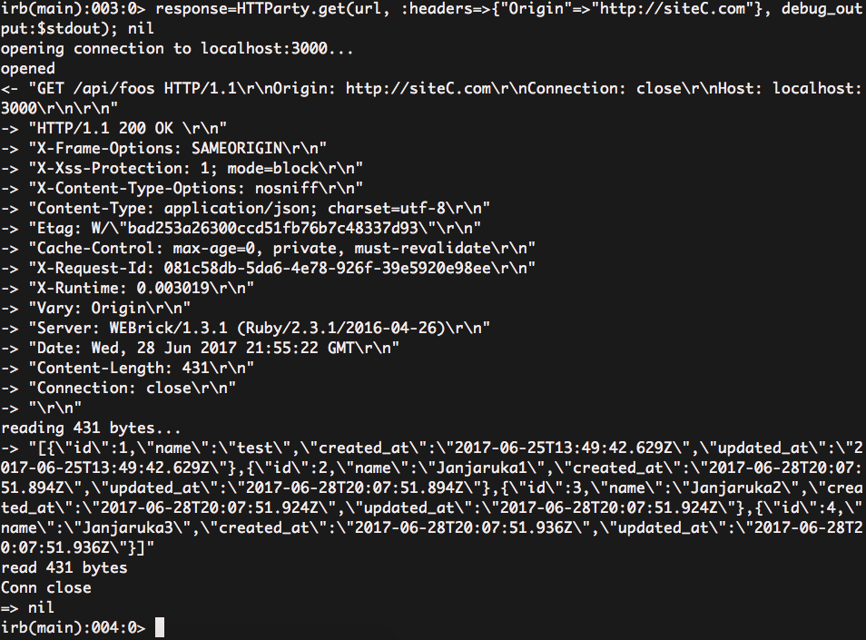
<hr>

In dev mode, if unsure on where to deploy (*security people close your eyes in this segment* :-), I can tweak the code in application.rb to open it up as below.

```ruby
    config.middleware.insert_before 0, "Rack::Cors" do
      allow do
        origins '*'

        resource '/api/*',
          :headers => :any,
          :methods => [:get, :post, :put, :delete, :options]
        end
      end
```

and just as expected, we get access in [Site C](http://www.sitec.com/).

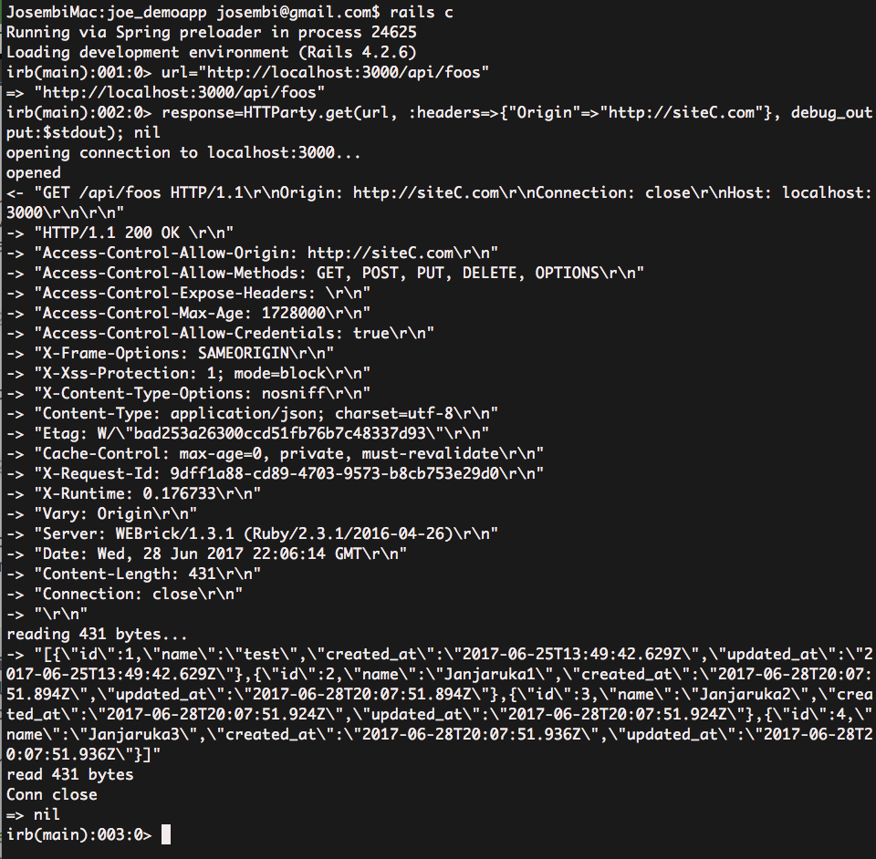
<hr>

Summarilly, it's intuitive that;
* APIs & UI code may be independently deployed.
* There exists an origin risk to browsers.
* APIs must support browser headers for CORS to work.


### Alternate Web Servers

Rails web servers are Modular Web Servers Interfaces used by Ruby-based frameworks like Rails, Sinatra, Padrino, Hanami, etc.
Puma is a good web server due to its dev and prod capabilities but I prefer Webrick in dev because its simple and lightweight.

**Warning**: *Development != Production* Heroku won't deploy your Dev data like GitHub does.

I installed puma and eventually it came to bite me. Server crashed for some reason that spring preloader knows well, had to revert to Webrick.

*Fixed server issue which was emanating from application.rb (open block)*

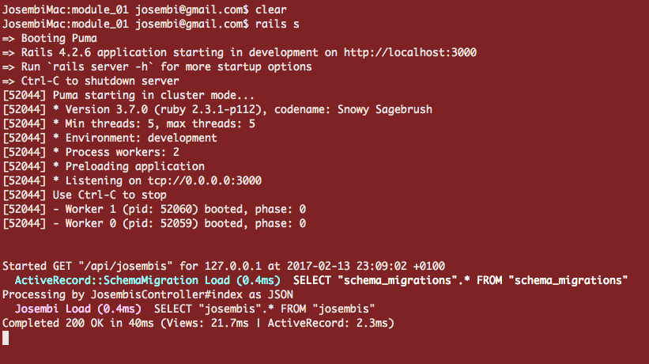
<hr>

I also installed [pry](https://github.com/pry/pry),  *(gem 'pry-rails', '~>0.3', '>=0.3.4')* which is an alternative to IRB (think of google as an alternative to bing) with awesome color integrations and advanced features. I tried to query **Bar** after installation, see below.

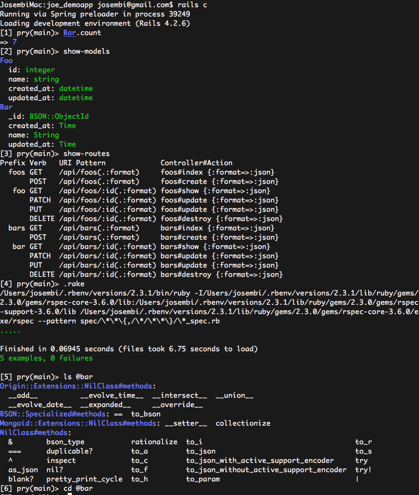
<hr>

Actually, instead of using [Byebug](https://github.com/deivid-rodriguez/byebug) for debugging, you can write a statement (binding.pry) that works with the [pry-byebug](https://github.com/deivid-rodriguez/pry-byebug) within the errors thrown by rspec, and pry shell will drop you to the code for rectification when you run **.rake**.


### Provisioning mLab MongoDB

At this stage I'll do provisioning of two databases. One for Staging and the other for Production, which will be used by Heroku and can be used for local production as well.
As you can see below, I've created a staging collection Mockup (*don't be afraid, I'll have tossed and created a new production instance by the time you are reading this with different user credentials*).  This will be supplied via the environment variable in Heroku.

**NB: mLab which is a MongoDB-as-a-Service (DBaaS) provider was acquired by MongoDB and this year 2020 I had to migrate all my NoSQL databases elsewhere. The pressure for data platforms to get to the cloud “fast” is significant and that's why cloud providers like AWS and Azure have been growing enormously**

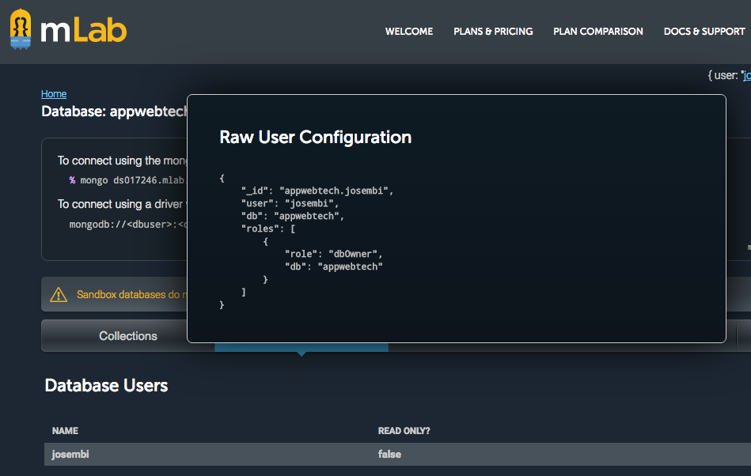
<hr>

I've assigned a username and password and I've got the access credentials to my Mongo via a URL. At this time I need a Username, Password, Hostname, Port number and the name of DB. I'll be using Amazon Web Services as my cloud provider (EU West-1 Ireland) which is near my location.

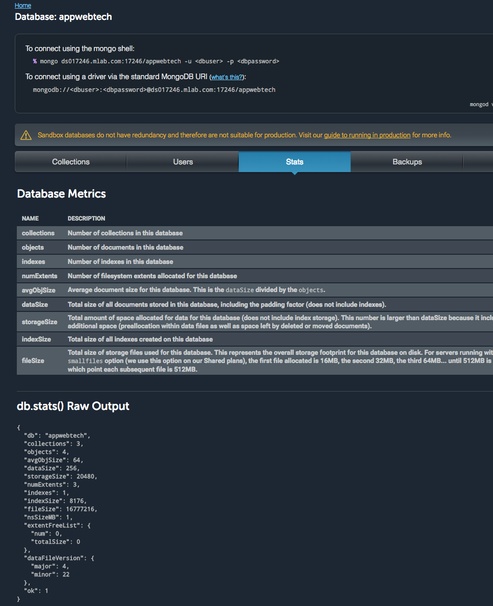
<hr>

You can see my Collection Metrics configuration below.

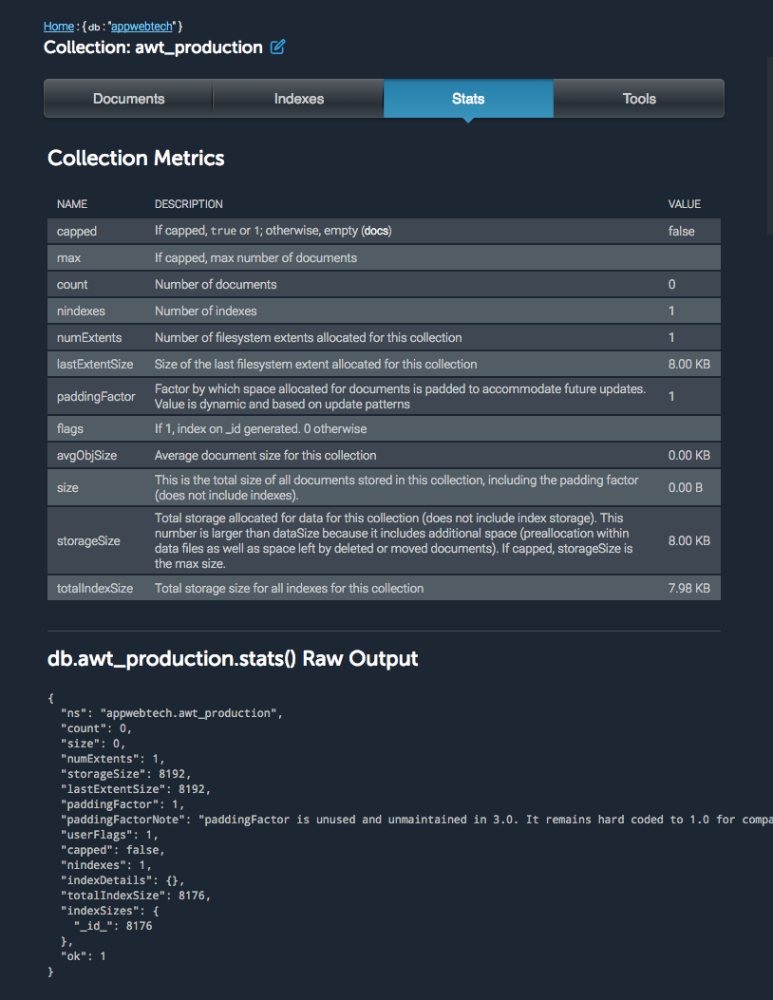
<hr>

### Provisioning Heroku Sites

I will be provisioning Heroku sites, both staging and production. I will do deploying revisions both from the master as well as feature branches, just to shake off the rust as this is a review, then after deploying some basic data I'll add the Heroku links.


Before I get to Deployment, I have to FIX any code that is not parsing. By running rspec both globally and targeting the two databases in full documentation mode (-fd), I find some minor errors in the view which I fix and refactor my code.

I've installed *pry shell* which is user-friendly compared to rails c which is verbose in my opinion; it's a question of personal opinions and tastes anyway.

Running rspec whilst targeting RDBMS in -fd mode. Found a link error which I fixed.
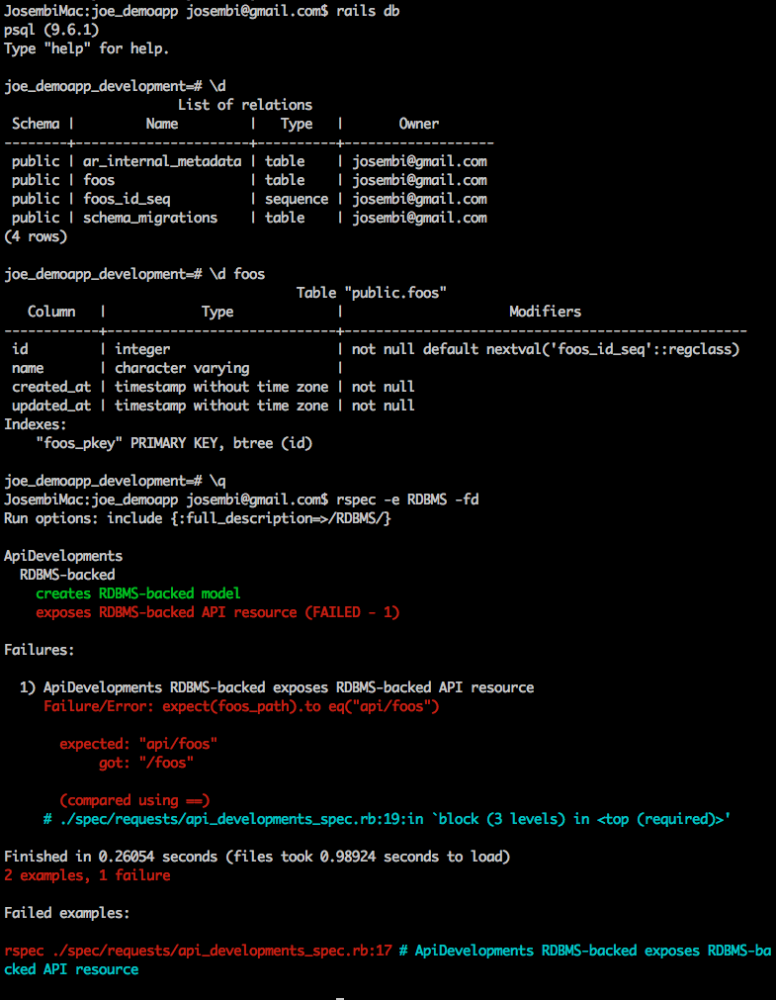
<hr>

Running rspec in global scope. Fixed some esoteric errors on View, and fixed routes to render JSON which was been bypassed by html.erb. Rails 5.0.1 defaults to HTML within the view. We need BSON to transfer data within our Mongo.
If your app is throwing such errors, go fix them and once you get them out of the way, re-run rspec again.

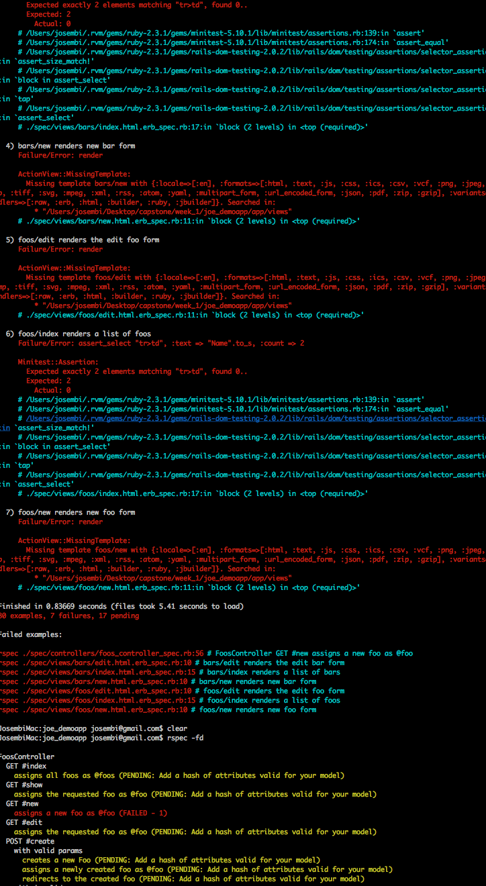
<hr>

After the fixes, I re-ran rspec once again and code parsed both globally and within the RDBMS and Mongo targeted instances. Cool! Ready to deploy.

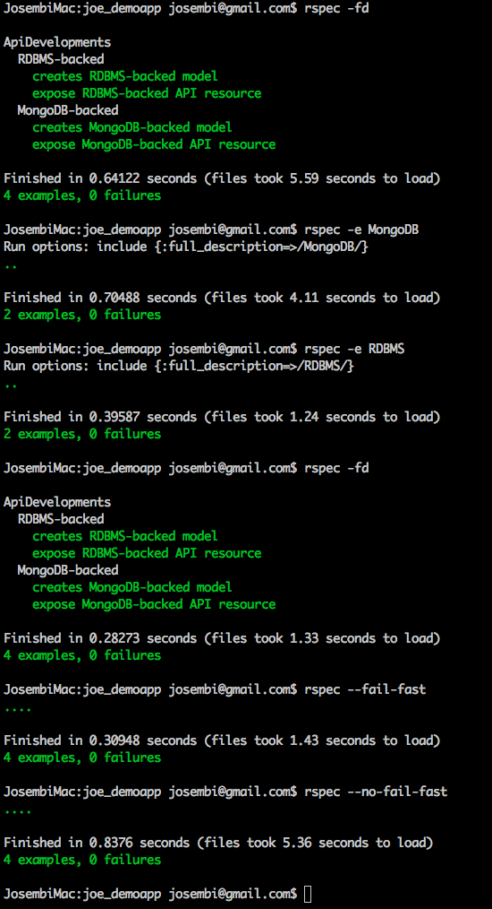
<hr>

### Gemfile summary

Here I did a quick sanity check before deployment.
I actually updated gems like byebug, pry (runs in a shell inside rails console)

## API Deployment

What I did is create two remotes, one for **Staging** and the another for **Production**. Instead of pushing directly, I created a branch and pushed to my staging remote and did the same for production, pushing to the master branch of Heroku.
No error's thrown or gems tossed (which happens a lot in windows), just warnings which I'll handle momentarily.

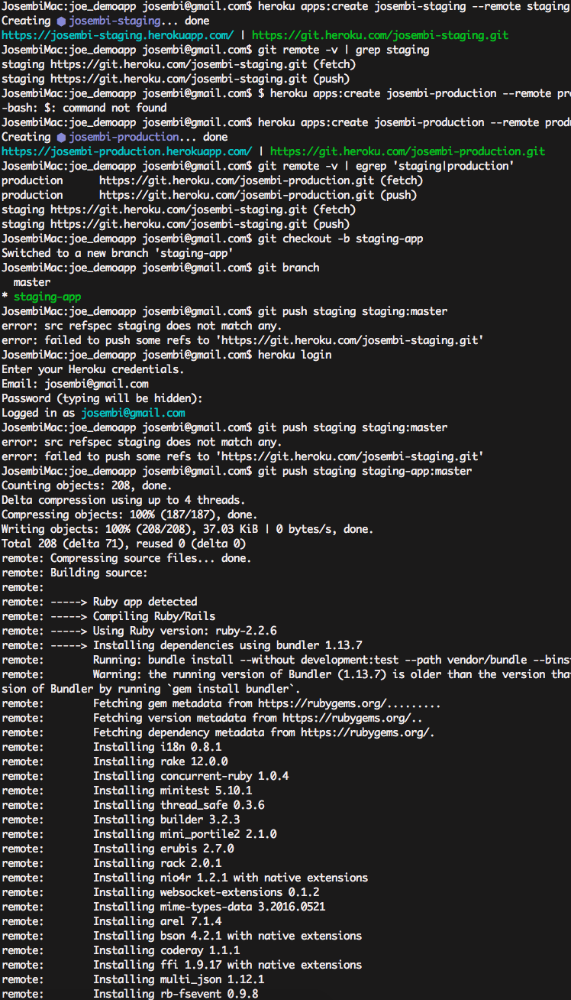


I tried accessing the staged app remotely, but it returned an error. Sometimes this happens when there is nothing on the View, so I took the liberty of creating one, and pushing once again.
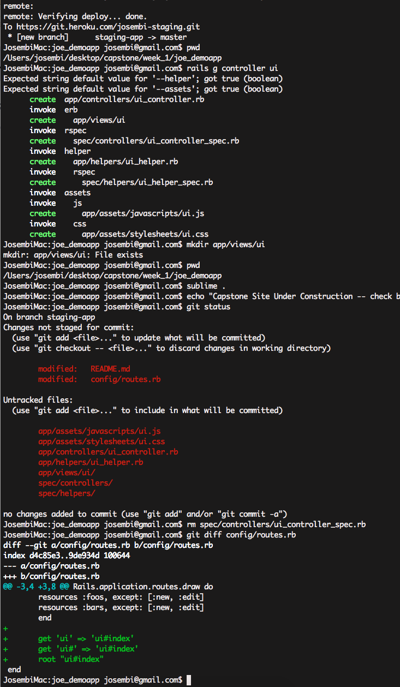
<hr>

Tried accessing the url again. Production instance works remotely, staged instance fails to comply. I decided to access the logs..... then realised that Heroku compiler was having issues with the router whilst issuing GET request. :-(

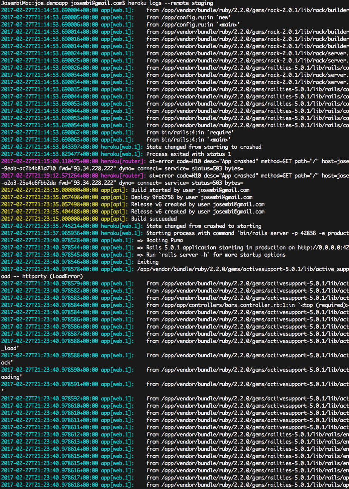
<hr>

I hit StackOverflow and after reading some vague posts, I did migrations of the DB to Heroku servers. I still had errors thrown at me until I realized that Fastweb Italia was blocking some of my ports truncating data transfer to Heroku (Port 5000 communicates with Heroku Servers). Very frustrating for a simple transfer with little to no server hog.   

Instead of the esoteric port bypass I use to manage my servers, I tried running detached DB migrations in Heroku (which amazingly worked) then re-created new Mongo DB's instances in mLab as I had tossed the previous ones, subsequent to which I linked them to my API, deployed and life was good once again.

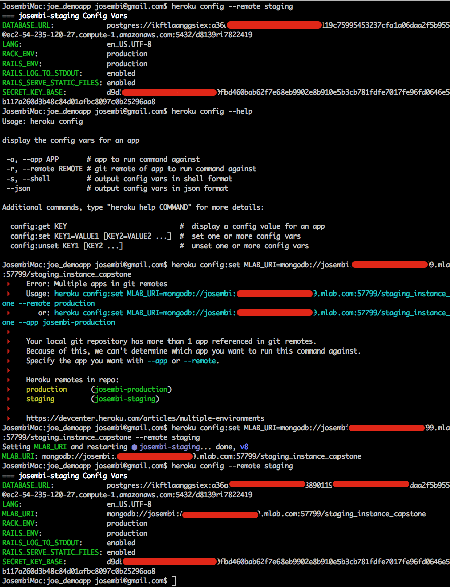
<hr>

### Staging Instances
After fixing my code, I pushed to Heroku and the [view](https://josembi-jhu.herokuapp.com/) is working. My [RDBMS](https://josembi-jhu.herokuapp.com/api/foos) is working as well, with an empty collection as the data used in Dev mode is never deployed to Production.

My [MongoDB](https://josembi-jhu.herokuapp.com/api/bars ) is working as it's connected to MLAB where it's fetching data, and it should show an empty collection as well as there is no data there yet. I have enforced the use of SSL for security purposes.


<hr>

**NB** ***In module 2 I deployed my UI stack on top of Module 1 builds so the url's will appear the same :-(. Next time I'll invest on a good camera and make some video tutorials.***

<hr>

**Homepage**
https://josembi-jhu.herokuapp.com/

**RDBMS instance**
https://josembi-jhu.herokuapp.com/api/foos

**Mongo instance (staging)**
https://josembi-jhu.herokuapp.com/api/bars

NB: *MongoDB will throw a server error (500) as I have migrated my DBs from MLAB to AWS*
<hr>


At heroku, you can see my staging instance successful build below.

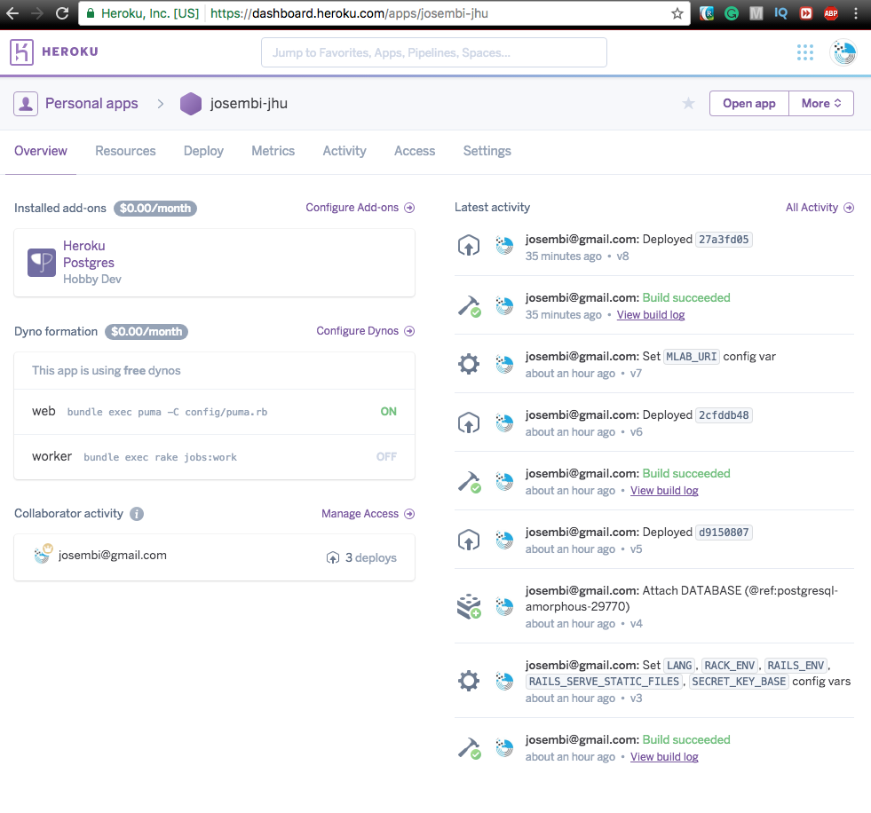

<hr>


### Production Instances

What I did next was checkout from the staging branch (git), merged to master and pushed to production master. Accessing the [production view](https://josembi2-jhu.herokuapp.com/) works.

[RDBMS](https://josembi2-jhu.herokuapp.com/api/foos) was not working until I ran a detached rake DB and now it works.

<hr>

**Homepage**
https://josembi2-jhu.herokuapp.com/

**RDBMS instance**
https://josembi2-jhu.herokuapp.com/api/foos

**Mongo instance (production)**
https://josembi2-jhu.herokuapp.com/api/bars

<hr>

At Heroku, you can see my production instance successful build below.

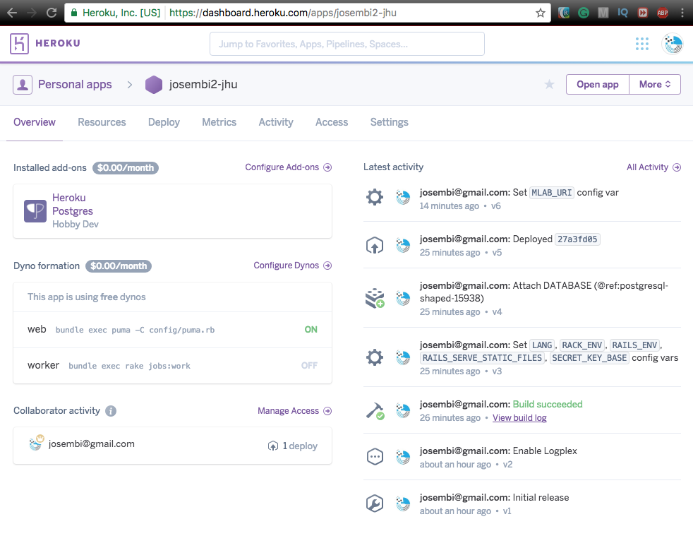
